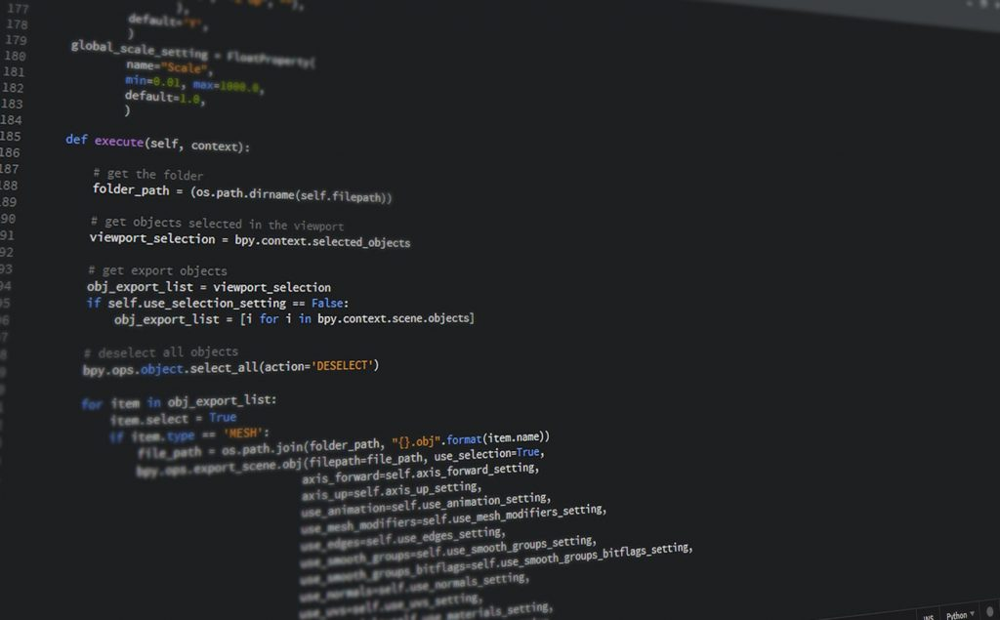

# Sistema Login Back-End

<!---Esses são exemplos. Veja https://shields.io para outras pessoas ou para personalizar este conjunto de escudos. Você pode querer incluir dependências, status do projeto e informações de licença aqui--->




> Desenvolvi uma aplicação Back-End [CLI] utilizando *Python*

### Ajustes e melhorias

O projeto ainda está em desenvolvimento e as próximas atualizações serão voltadas nas seguintes tarefas:

- [ ] Desenvolvimento multiplayer

## 💻 Pré-requisitos

Antes de começar, verifique se você atendeu aos seguintes requisitos:
<!---Estes são apenas requisitos de exemplo. Adicionar, duplicar ou remover conforme necessário--->
* Foi Utilizado a versão mais recente de Python 3.10.
* Utilizando uma máquina Windows sendo compativel com qualquer S.O.
* Foi utilizado para Desenvolvimento: Documentação Python

## 🚀 Instalando Projeto Python

Para instalar o Python, siga estas etapas:

Linux e macOS:
```
Git Clone url_do_projeto
Abrir pasta project -> inciar py main.py
```

Windows:
```
Git Clone url_do_projeto
Abrir pasta project -> Abrir pasta project -> inciar py main.py
```

